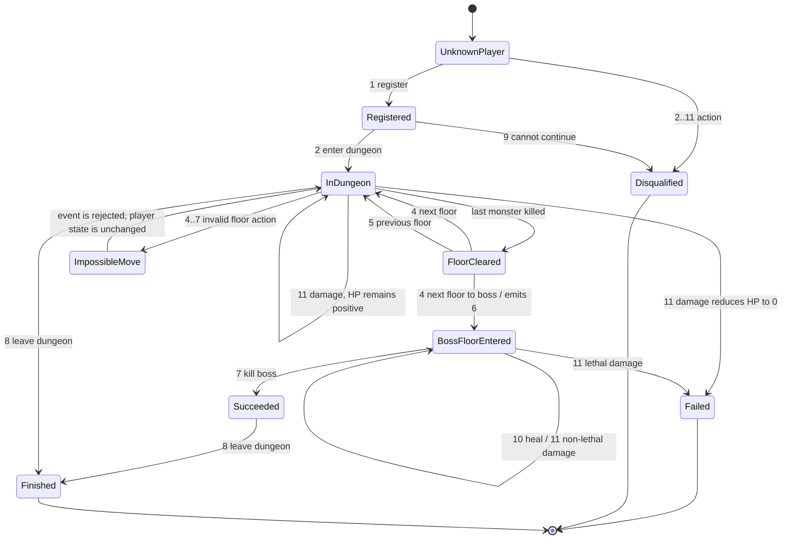

# Dungeon Challenge Event Processor

This repository is a Go prototype for processing a dungeon challenge event
stream. It reads a JSON configuration, consumes chronological events from
standard input, updates each player's dungeon run, prints the normalized
outgoing event log, and emits the final report.


[I also added a polished TUI interface on top of the core task.](https://github.com/XyL1GaN4eG/yadro-telecom-impulse/tree/implement-bubbletea)


## What It Models

A registered player enters a dungeon, clears monster floors, reaches the boss
floor, defeats the boss, or exits early through failure and disqualification
paths. The implementation keeps the run state in memory and applies one event at
a time.

The product contract is defined in [docs/README.md](docs/README.md). The current
code implements the event parser, command handler, player state transitions,
outgoing event formatting, dungeon close handling, and final report generation.

## State Machine



## Event Flow

```text
stdin event line
  -> parser.Split
  -> handler.HandleCommand
  -> player.Players in-memory state
  -> format.Command / format.Disqualified / format.Dead / format.ImpossibleMove
  -> stdout

EOF or dungeon close
  -> format.FinalReport
  -> stdout
```

Incoming event lines use this format:

```text
[HH:MM:SS] <player_id> <event_id> [extra_param...]
```

Example:

```text
[14:49:02] 1 10 80
```

Output:

```text
[14:49:02] Player [1] has restored [80] of health
```

## Event Reference

| ID | Input meaning    | Handler behavior                                                                       |
|---:|------------------|----------------------------------------------------------------------------------------|
|  1 | Register player  | Creates a player with 100 HP, status `FAIL`, floor `0`, and a dungeon run from config  |
|  2 | Enter dungeon    | Requires registration; otherwise emits disqualification                                |
|  3 | Kill monster     | Decrements monsters on the current non-boss floor and clears it at zero                |
|  4 | Next floor       | Requires the current floor to be cleared; entering the boss floor also emits event `6` |
|  5 | Previous floor   | Requires a live player in the dungeon and a floor above `0`                            |
|  6 | Enter boss floor | Requires the current floor to be the boss floor; duplicate notifications are ignored   |
|  7 | Kill boss        | Requires boss floor entry; marks status `SUCCESS`                                      |
|  8 | Leave dungeon    | Marks the live player as finished                                                      |
|  9 | Cannot continue  | Marks player as `DISQUAL` and finished                                                 |
| 10 | Heal             | Adds health, capped at `100`                                                           |
| 11 | Damage           | Subtracts health; at `0` HP marks status `FAIL` and emits death                        |

Invalid floor actions in `4..7` are rejected as:

```text
[HH:MM:SS] Player [id] makes imposible move [eventID]
```

The spelling above matches the documented output contract and current formatter.

## Configuration

The binary accepts an optional config path. Without an argument it reads
`docs/config.json`.

```json
{
  "Floors": 2,
  "Monsters": 2,
  "OpenAt": "14:05:00",
  "Duration": 2
}
```

Current implementation notes:

| Field      | Used by current code                                             |
|------------|------------------------------------------------------------------|
| `Floors`   | Builds the dungeon, where the last floor is the boss floor       |
| `Monsters` | Sets monster count for each non-boss floor                       |
| `OpenAt`   | Defines the dungeon opening time used for close-time calculation |
| `Duration` | Closes active runs at `OpenAt + Duration` hours                  |

## Final Report

At the end of input, active unfinished runs are closed at `OpenAt + Duration`.
The final report is sorted by player ID and contains:

```text
[STATE] player_id [total_time, average_floor_clear_time, boss_kill_time] HP:health
```

`average_floor_clear_time` excludes the boss floor. Time spent on a floor after
it has been cleared is not counted.

## Run

```bash
go run . docs/config.json < docs/events
```

Or use the default config path:

```bash
go run . < docs/events
```

Build a local binary:

```bash
go build -o impulse .
./impulse docs/config.json < docs/events
```

## Test


```bash
go test ./...
```

## Project Layout

```text
cmd/app              CLI entry point: config loading, stdin loop, stdout formatting
internal/parser      Event-line parsing and time normalization
internal/handler     Event dispatch and state transition rules
internal/player      Player, floor, dungeon-run state
internal/format      Outgoing event text formatting
internal/game        JSON configuration shape
docs                 Contract, sample config, sample events
docs/vhs             VHS tapes and prompt setup for reproducible terminal GIFs
docs/assets          Generated README GIFs
```
