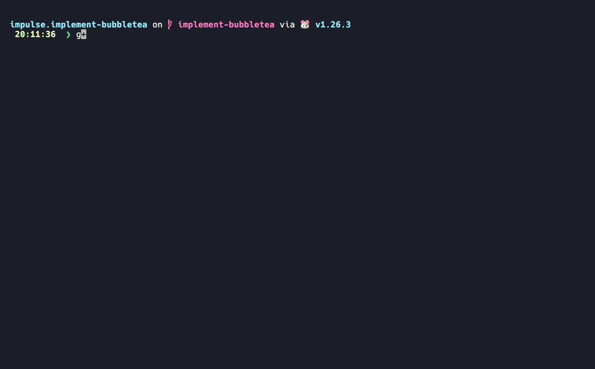
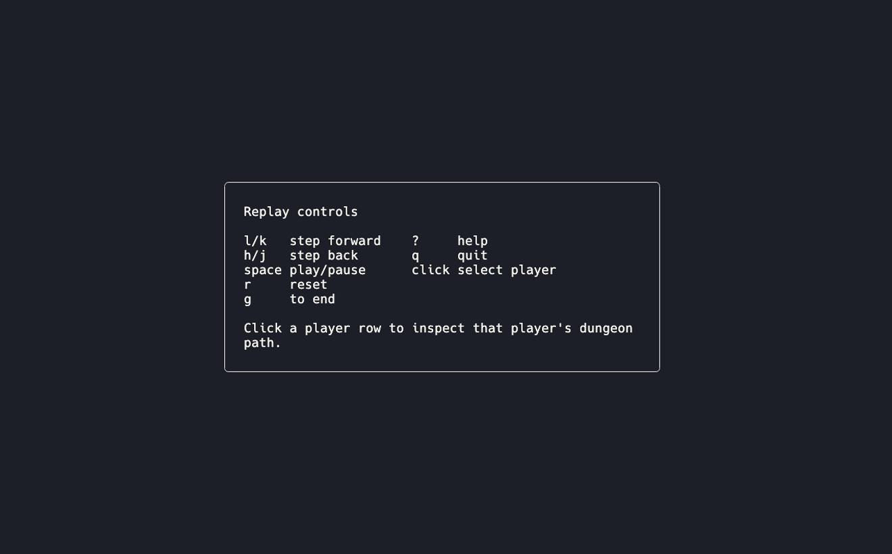
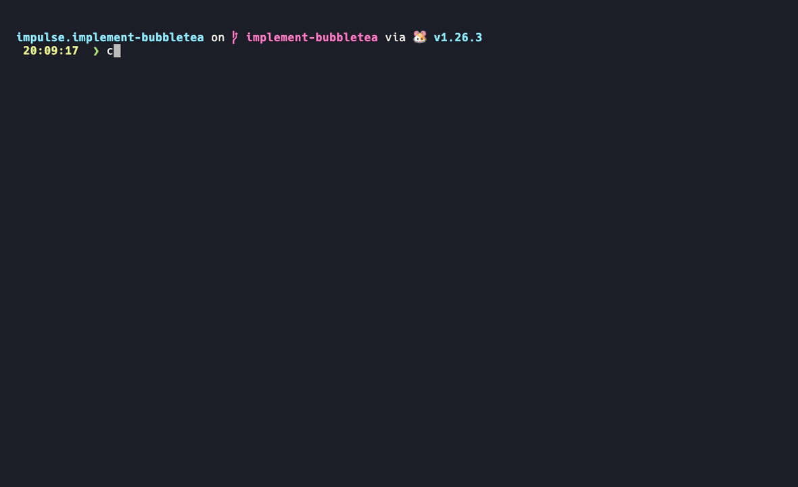
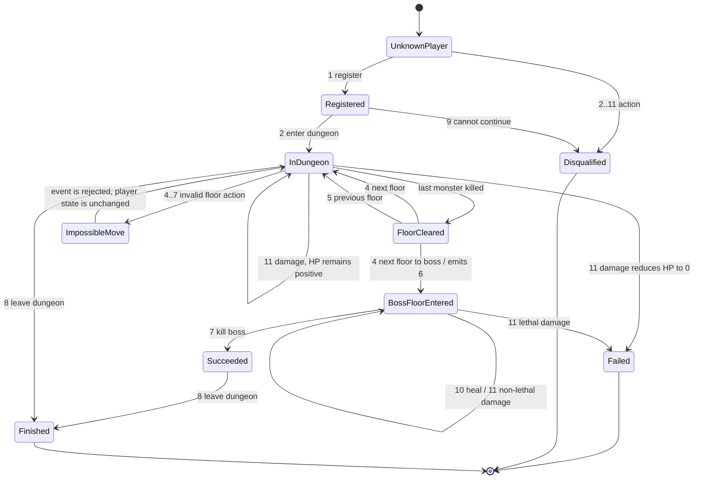
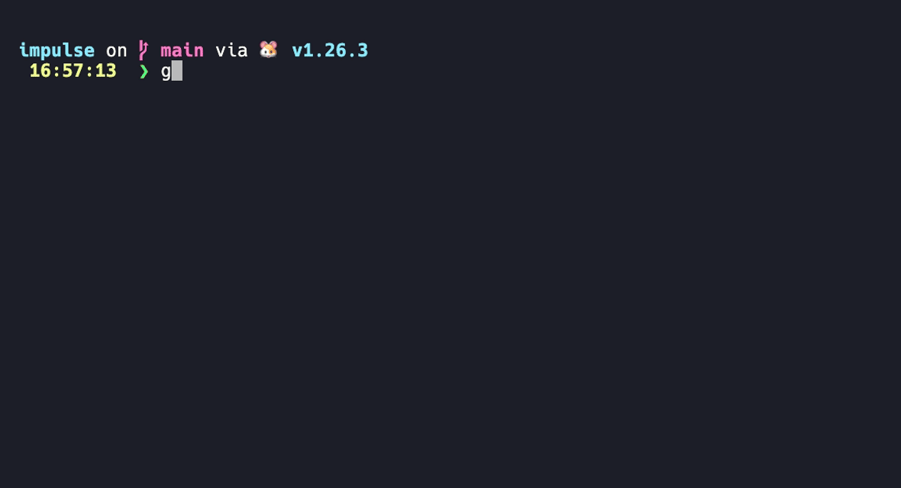

# Impulse

Impulse is a Go replay tool for a dungeon challenge event stream. It keeps the
original stdout CLI, and this branch adds a Bubble Tea terminal UI for visual
replay/debugging of the same core state transitions.



## Bubble Tea Replay UI

Run the TUI with an explicit `tui` subcommand:

```bash
go run . tui docs/config.json docs/events
```

The TUI reads the same config and event file as the CLI, then lets you replay
the simulation step by step. It does not replace the engine: events are still
parsed by `parser.Split`, processed through `handler.HandleCommand`, formatted
through `format.*`, and stored in `game.Cfg` plus `player.Players`.

The screen is split into:

| Panel | Purpose |
| --- | --- |
| Timeline | Incoming event stream with the current step marker |
| Dungeon | ASCII dungeon map: `START`, every floor, boss floor, `EXIT`, players on each location |
| Players | Clickable player list with HP, status, floor, entered/finished flags |
| Output | README-style outgoing event log and final report |

The dungeon panel follows the selected player. Click a row in `Players` to
inspect that player's run, including total time, average floor clear time, boss
kill time, floor clear state, monsters left, and time spent on each floor.



Controls:

| Key               | Action                                                    |
|-------------------|-----------------------------------------------------------|
| `l` / `k` / right | Step forward                                              |
| `h` / `j` / left  | Step back by resetting and replaying to the previous step |
| space             | Play / pause autoplay                                     |
| `g` / `G`         | Replay to the end                                         |
| `r`               | Reset to the beginning                                    |
| `?`               | Toggle help                                               |
| esc               | Close help                                                |
| mouse click       | Select a player in the `Players` panel                    |
| `q` / ctrl+c      | Quit                                                      |

Autoplay advances every 500ms. When replay reaches the dungeon close time or the
end of the event stream, active players are closed and the output panel receives
the same final report as the CLI.

## CLI Mode

The original CLI path is preserved:

```bash
go run . docs/config.json < docs/events
```

Or use the default config path:

```bash
go run . < docs/events
```

Example output:



Build a local binary:

```bash
go build -o impulse .
./impulse docs/config.json < docs/events
./impulse tui docs/config.json docs/events
```

## What It Models

A registered player enters a dungeon, clears monster floors, reaches the boss
floor, defeats the boss, or exits early through failure and disqualification
paths. The implementation keeps the run state in memory and applies one event at
a time.

The product contract is defined in [docs/README.md](docs/README.md). The current
code implements parsing, command handling, player state transitions, outgoing
event formatting, dungeon close handling, final report generation, and a replay
UI shell over that flow.

## Event Flow

```text
stdin/file event line
  -> parser.Split
  -> replay.ProcessCommand
  -> handler.HandleCommand
  -> player.Players in-memory state
  -> format.Command / format.Disqualified / format.Dead / format.ImpossibleMove
  -> CLI stdout or TUI output log

EOF or dungeon close
  -> handler.CloseActivePlayers
  -> format.FinalReport
  -> CLI stdout or TUI output log
```

Incoming event lines use this format:

```text
[HH:MM:SS] <player_id> <event_id> [extra_param...]
```

Example:

```text
[14:49:02] 1 10 80
```

Output:

```text
[14:49:02] Player [1] has restored [80] of health
```

## State Machine



## Event Reference

| ID | Input meaning | Handler behavior |
| ---: | --- | --- |
| 1 | Register player | Creates a player with 100 HP, status `FAIL`, floor `0`, and a dungeon run from config |
| 2 | Enter dungeon | Requires registration; otherwise emits disqualification |
| 3 | Kill monster | Decrements monsters on the current non-boss floor and clears it at zero |
| 4 | Next floor | Requires the current floor to be cleared; entering the boss floor also emits event `6` |
| 5 | Previous floor | Requires a live player in the dungeon and a floor above `0` |
| 6 | Enter boss floor | Requires the current floor to be the boss floor; duplicate notifications are ignored |
| 7 | Kill boss | Requires boss floor entry; marks status `SUCCESS` |
| 8 | Leave dungeon | Marks the live player as finished |
| 9 | Cannot continue | Marks player as `DISQUAL` and finished |
| 10 | Heal | Adds health, capped at `100` |
| 11 | Damage | Subtracts health; at `0` HP marks status `FAIL` and emits death |

Invalid floor actions in `4..7` are rejected as:

```text
[HH:MM:SS] Player [id] makes imposible move [eventID]
```

The spelling above matches the documented output contract and current formatter.

## Configuration

The binary accepts an optional config path. Without an argument it reads
`docs/config.json`.

```json
{
  "Floors": 2,
  "Monsters": 2,
  "OpenAt": "14:05:00",
  "Duration": 2
}
```

| Field | Used by current code |
| --- | --- |
| `Floors` | Builds the dungeon, where the last floor is the boss floor |
| `Monsters` | Sets monster count for each non-boss floor |
| `OpenAt` | Defines the dungeon opening time used for close-time calculation |
| `Duration` | Closes active runs at `OpenAt + Duration` hours |

## Final Report

At the end of input, or when replay reaches dungeon close time, active unfinished
runs are closed at `OpenAt + Duration`. The final report is sorted by player ID
and contains:

```text
[STATE] player_id [total_time, average_floor_clear_time, boss_kill_time] HP:health
```

`average_floor_clear_time` excludes the boss floor. Time spent on a floor after
it has been cleared is not counted.

## Test



```bash
go test ./...
```

## Project Layout

```text
cmd/app              CLI/TUI entry point and mode selection
internal/replay      Shared event processing wrapper used by CLI and TUI
internal/tui         Bubble Tea model, layout, controls, mouse zones, ASCII dungeon view
internal/parser      Event-line parsing and time normalization
internal/handler     Event dispatch and state transition rules
internal/player      Player, floor, dungeon-run state and timing helpers
internal/format      Outgoing event text and final report formatting
internal/game        JSON configuration and open/close time helpers
docs                 Contract, sample config, sample events
docs/vhs             VHS tapes and prompt setup for reproducible terminal GIFs
docs/assets          Generated README GIFs and PNG frames
```

## Regenerate Terminal Assets

The terminal animations are generated with
[Charm VHS](https://github.com/charmbracelet/vhs). VHS records terminal GIFs from
code-like `.tape` files and requires `vhs`, `ttyd`, and `ffmpeg` on `PATH`.
The tapes run under `fish` and source [docs/vhs/prompt.fish](docs/vhs/prompt.fish)
so the recordings keep the Starship prompt visible instead of collapsing to a
transient prompt.
